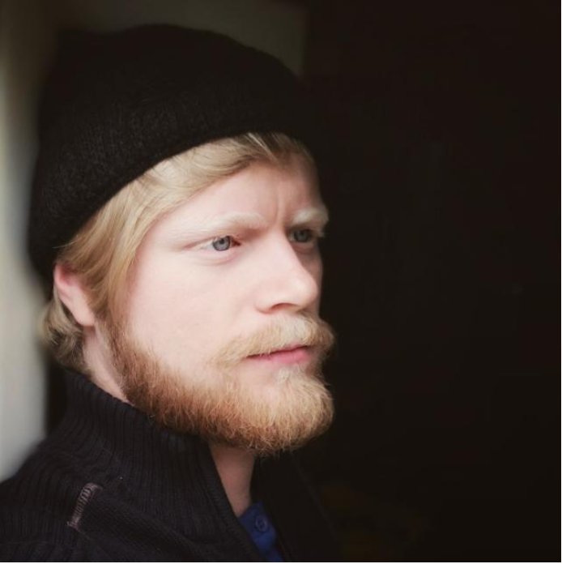

# Özgür Kan

Kişisel bloguma gitmek için tıklayınız: https://ozgurkan.github.io/OzgurKan/

 

### Merhabalar 👋
 Ben Özgür Kan  Machine Learning || Data Science || Deep Learning || Full Stack Web Developer || ve her zaman yeni teknolojiler ve alanlarda öğrenmeye ve çalışmaya istekliyim.
 
 
 <!DOCTYPE html>
<html>
<title>ÖZGÜR KAN</title>
<link rel="icon" href="images/favicon.ico" type="image/gif" sizes="16x16"><!--Site favicon -->
<meta charset="UTF-8">
<meta name="viewport" content="width=device-width, initial-scale=1">
<link href="css/ok.css" rel="stylesheet" type="text/css" />
<link rel="stylesheet" href="images/icons/font-awesome-4.7.0/css/font-awesome.min.css">

<body class="ok-light-grey ok-content" style="max-width:2560px">

<!-- Sidenav/menu -->
<nav class="ok-sidenav ok-collapse ok-white ok-animate-left" style="z-index:3;width:300px;" id="mySidenav"> 
    

        
        <h3 style="margin-top: 10px;padding-left: 0px;float: left;"><b>ÖZGÜR KAN</b></h3>
        
Kişisel Blog

        <a href="#" onclick="ok_close()" class="ok-hide-large ok-right ok-large ok-padding" title="close menu">
            <i class="fa fa-remove"></i>
        </a>
    

    

        <a href="https://www.facebook.com/ozgur.kan.7" target="_blank" class="ok-hover-white ok-hover-text-indigo ok-show-inline-block"><i class="fa fa-facebook-official fa-2x"></i></a>
        <a href="https://www.instagram.com/kan_ozgur/"  target="_blank" class="ok-hover-white ok-hover-text-purple ok-show-inline-block"><i class="fa fa-instagram fa-2x"></i></a>
        <a href="https://www.snapchat.com/add/ozgur_kan" target="_blank" class="ok-hover-white ok-hover-text-yellow ok-show-inline-block"><i class="fa fa-snapchat fa-2x"></i></a>
        <a href="mailto:galatasaray_ozgur_94@hotmail.com" target="_blank" class="ok-hover-white ok-hover-text-red ok-show-inline-block"><i class="fa fa-envelope fa-2x"></i></a>
        <a href="https://github.com/ozgurkan" target="_blank" class="ok-hover-white ok-hover-text-indigo ok-show-inline-block"><i class="fa fa-github fa-2x"></i></a>
        <a href="https://www.linkedin.com/in/ozgurkan/" target="_blank" class="ok-hover-white ok-hover-text-indigo ok-show-inline-block"><i class="fa fa-linkedin fa-2x"></i></a>
    

    

    <a href="index.html" onclick="ok_close()" class="ok-padding ok-text-teal"><i class="fa fa-home fa-fw ok-margin-right"></i>ANASAYFA</a>
    <a href="hakkimda.html" onclick="ok_close()" class="ok-padding"><i class="fa fa-id-card fa-fw ok-margin-right"></i>HAKKIMDA</a>
    <a href="favoriler.html" onclick="ok_close()" class="ok-padding"><i class="fa fa-star fa-fw ok-margin-right"></i>FAVORİLER</a>
    <a href="detection.html" onclick="ok_close()" class="ok-padding"><i class="fa fa-fire fa-fw ok-margin-right"></i>OBJECT DETECTİON</a>

    <!--

        <h1>DERSLER</h1>
        <ul>
            <?php
            $sayi = 1.0;
            $dersler= mysql_query("select * from Dersler WHERE Ders_Durumu=1 ");
            if(mysql_num_rows($dersler)==0){
            }else{
                while($satır=mysql_fetch_array($dersler)){
                    $sayi=$sayi+0.2;
                    ?>

                    <li style="animation-duration:<?php echo $sayi;?>s;"><a href="<?php echo $satır['Ders_linki'];?>"><h3><?php echo $satır['Ders_adi'];?></h3></a></li>
                <?php }}?>

        </ul>
    
    
-->

</nav>

<!-- Overlay effect when opening sidenav on small screens-->

<!-- !PAGE CONTENT! -->

    <!-- Header -->
    <header class="ok-container" id="portfolio">
        
        <i class="fa fa-bars"></i>

        <h3><i class="fa fa-hashtag ok-margin-right"></i><b>EvdeKal</b></h3>
        

            <button class="ok-btn" style="margin: 2px"><i class="fa fa-calendar ok-margin-right"></i>Son Konular</button>
            <button class="ok-btn ok-white" style="margin: 2px"><i class="fa fa-fire ok-margin-right"></i>Popüler Konular</button>
            <button class="ok-btn ok-white " style="margin: 2px"><i class="fa fa-comments ok-margin-right"></i>En çok Yorum Alanlar</button>
        

    </header>
    <?php for($i=1;$i<=10;$i++){ ?>
        <!-- First Photo Grid-->
        

            

                

                    <h2 style="text-align:center"><b>Karantina Günlükleri</b></h2>
                    

                        Herkese merhaba evet evet yıllardır açılmayı bekleyen bu blogun açılışını yapmış bulunuyoruz.Kısmet bugüneymiş
                        diyelim bakalım ortaya neler çıkıcak :)
                        
                        Sene 2020 aylardan Mart dünya küresel bir salgın hastalığın pençesinde yuvarlanıp gidiyor. Bütün ülkeler 
                        kendi sınırlarını kapatıp karantina ilan ediyor. Evet bu yazıyı karantinadayken yazıyorum. Sonumuz ne olur belirsiz.
                        Uzun zamandan beri bekllettiğim hatta host alma aşamasına kadar gelip ertelediğim bu projemi şimdi hayata geçiriyorum.
                        Umarım şu karantina günlerimizde hem biraz eğleniriz hem de birşeyler öğreniriz.
                             
                        Kendinizi iyi bakın ve EVDE KALIN !!
                        
                    

                     
                    <!--<button class="button" style="vertical-align:middle" type="submit" >Devamını Oku</button>-->
                

            

            

                

                    <h2 style="font-size:xx-large;text-align:center;color:red;font-family: Impact, Charcoal, sans-serif"><b><strong>YouTube</strong></b></h2>                                            
                        <iframe style="overflow:hidden;width:100%" width="width:100%" height="315" src="https://www.youtube.com/embed/Dm4mHN0dL5Q" frameborder="0" allow="accelerometer; autoplay; clipboard-write; encrypted-media; gyroscope; picture-in-picture" allowfullscreen></iframe>
                    
                                         
                

            

        

    <?php }?>

    <!-- Pagination
    

        <ul class="ok-pagination">
            <li><a class="ok-black" href="#">1</a></li>
            <li><a class="ok-hover-black" href="#">2</a></li>
            <li><a class="ok-hover-black" href="#">3</a></li>
            <li><a class="ok-hover-black" href="#">4</a></li>
            <li><a class="ok-hover-black" href="#">»</a></li>
        </ul>
    
 -->

    <!-- Footer -->
    <footer class="ok-container ok-center ok-padding-24 ok-padding-32 ok-dark-grey">Powered by:
        <a href="index.html" title="özgür_kan" class="ok-hover-opacity">Özgür KAN</a>
    </footer>

    <!-- End page content -->

</body>
</html>

